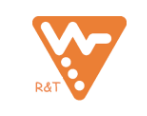
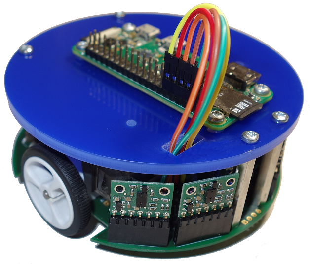
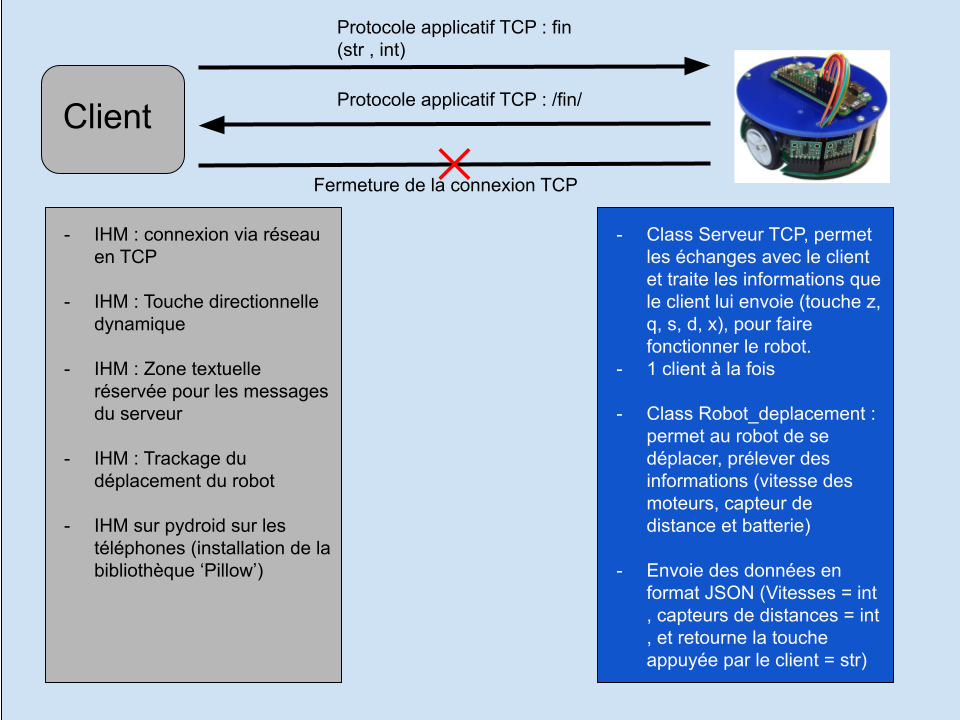
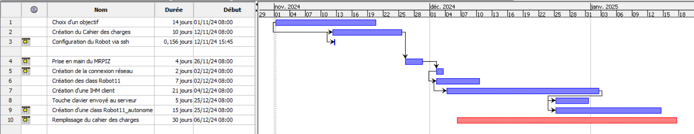

# MRPiZ_Project
v# Cahier des charges Projet `Robot application client serveur`

||
NGUYEN Anh Quan

SEVESTRE Hugo

2B1

POO2 SAE3.02

29/11/2024
||
| :-: | :-: | :-: |

# Sommaire
- [Sommaire](#sommaire)
  - [1. Présentation du projet](#1-présentation-du-projet)
  - [2. Contrainte à respecter](#2-contrainte-à-respecter)
  - [3. Objectif visé](#3-objectif-visé)
    - [3.1 étape 1](#31-étape-1)
    - [3.2 étape 2](#32-étape-2)
    - [3.3 étape 3](#33-étape-3)
    - [3.4 étape 4](#34-étape-4)
    - [3.5 étape 5](#35-étape-5)
    - [3.6 étape 6 (BONUS)](#36-étape-6-bonus)
  - [4 diagramme de Gantt](#4-diagramme-de-gantt)
  - [5 diagramme de classes](#5-diagramme-de-classes)
  - [6 Bilan](#6-bilan)
    - [6.1 Mise en place de la connectivité au robot via un téléphone](#61-mise-en-place-de-la-connectivité-au-robot-via-un-téléphone)
    - [6.2 Notre bilan du projet](#62-notre-bilan-du-projet)
  - [7 Annexe](#7-annexe)
    - [7.1 Code python du serveur](#71-code-python-du-serveur)
    - [7.2 Code python du l'IHM](#72-code-python-du-lihm)
    - [7.3 Code python du Robot](#73-code-python-du-robot)
  
## 1. Présentation du projet

> L'objectif est de mettre en marche le robot à distance en ayant un client qui le contrôle à distance, tout cela doit être réalisé en utilisant la programmation orientée objet et la programmation réseau, avec le langage Python.

> Robot MRPiZ, un robot qui doit être en mesure de se déplacer lorsque le client lui donne une instruction, par exemple : appuyer sur une touche directionnelle, gauche, droite, haut, bas, et le robot devra réagir en conséquence
Conditions dans le cas où le robot se retrouve devant un obstacle, il indiquera 'Un obstacle m'empêche d'avancer' et le robot s'arrêtera, même si le client persiste à avancer, ce message sera indiqué directement sur l'interface graphique du client.

> De plus, il sera doté d'une option autonome, qui lui permet de se déplacer librement tout en évitant les obstacles qui se retrouveraient sur son chemin.

## 2. Contrainte à respecter

>- Vous réaliserez une application client/serveur basée sur l’un des deux protocoles : TCP ou UDP

>- Vous choisirez le protocole (ou les protocoles) en fonction des spécificités de votre projet.

>- Vous justifierez vos choix

>- Vous devrez mettre en œuvre un protocole applicatif.

>- Vos applications client et serveur devront être réalisées en Python, en programmation objet (... mise en œuvre de classes).

>- Si votre application prévoit plusieurs clients, l’application cliente devra être unique.

>- Votre application cliente devra avoir nécessairement une interface graphique qui comportera un espace de configuration des paramètres réseaux.

>- Vous devrez aussi prévoir l’utilisation d’une base de données et/ou de fichiers de sauvegarde et de récupération de données.

>- Les échanges réseaux devront être faits sous la forme de **sérialisation dé-sérialisation au format json**

## 3. Objectif visé

> Le Robot MRPiZ doit être capable de réagir en fonction des instructions données par le 
Client distant qui le dirige avec une interface graphique, doit être aussi être capable de réaliser 2 tours complets lors d'un parcours et aussi dans le sens inverse.

> Nous allons utiliser la connexion via TCP, dans notre cas 1 seul client pourra se connecter car il n'y a qu'un seul robot, il serait possible de mettre une file d'attente pour les clients qui souhaitent contrôler le robot, et ainsi lorsque le robot sera libre, il pourra alors prendre le contrôle de ce dernier.
> La file d'attente se limitera à 5 personnes maximum.

### 3.1 étape 1

> Mise en marche du Robot MRPiZ

> On a commencé par lire la documentation sur le démarrage du robot afin de savoir comment se connecter au robot en SSH.
> Une fois la connexion au robot effectuée, nous avons parcouru les différents dossiers afin de voir si des fichiers étaient déjà présents ou non.

### 3.2 étape 2

> Création de la connexion réseau via le protocole TCP, et mise en place d'un protocole applicatif (fin, fin-ack) avec une interface graphique

> Nous allons créer une interface graphique qui pourra se connecter au robot via le protocole TCP.
> Via l'interface graphique, nous pourrons sélectionner deux modes : automatique et manuel.
> En mode automatique, le robot se déplacera en autonomie en effectuant un circuit, tout en évitant les bords pour s'empêcher d'être bloqué.
> En mode manuel, le robot sera dirigé par le client via les touches [z,q,s,d] . Lorsque le client appuiera sur l'une de ces touches, le robot exécutera l'action concernée par la touche.
> Sur l'interface graphique, sera également présent un bouton qui permettra de quitter l'interface graphique et donc de se déconnecter par la même occasion du robot. Il sera également possible de quitter en envoyant le message /fin/ dans le champ message de la fenêtre message ou en cliquant sur la croix.

### 3.3 étape 3

> Création d'une class Robot11

> La class Robot11 permettra au client de pouvoir contrôler le robot à l'aide des touches [z,q,s,d].
> De plus, cette classe permettra au robot de détecter des obstacles comme les bordures du circuit grâce à ses trois capteurs avant afin de ne pas foncer dedans.
> Pour cela, si le client veut faire avancer le robot dans une bordure du circuit, le robot refusera d'avancer et enverra un message au client afin de lui demander de changer de direction.

### 3.4 étape 4

> Création d'une class Robot11_autonome

> Cette class permettra au robot de se déplacer en autonomie sur le circuit tout en évitant de se bloquer dans les coins du circuit et en évitant de foncer dans les bordures du circuit grâce à ses trois capteurs avant.

### 3.5 étape 5

> Test du bon fonctionnement du robot, mise en condition par la création d'un circuit

> Nous testerons au fur et à mesure de notre avancée si le code que nous réalisons est bien fonctionnel afin de pouvoir déceler au mieux et plus facilement d'où provient le problème.

### 3.6 étape 6 (BONUS)

> Création d'une file d'attente liée à l'interface graphique

> La file d'attente permettra à un deuxième client voulant se connecter au robot d'être mis en file d'attente ; un message lui sera envoyé lors de sa tentative de connexion afin de le prévenir que le robot est déjà en cours d'utilisation par un autre client.
> Si le client principal se déconnecte, le robot se replacera à son emplacement de départ et le deuxième client pourra se connecter au robot une fois que le robot lui aura envoyé un message le prévenant que le robot est maintenant accessible.

## 4 diagramme de Gantt

## 5 diagramme de classes
|  Classe IHM_Robot11 hérite de Tkinter | Description | 
|:-|:-|
| # Attributs |          | 
| def __init __ (self): |  |  
| # Partie connexion | Section dédiée à la gestion de la connexion avec le serveur. Comprend des champs et des boutons pour configurer les paramètres de connexion (IP et port). |
| self.__client_tcp: IHM_Robot11 | Permet l'échange avec le serveur via des messages TCP. |
| self.__fen_connexion: Frame | Cadre contenant les éléments d'interface pour la connexion. |
| self.__label_ip: Label | Étiquette descriptive pour indiquer où saisir l'adresse IP. |
| self.__entree_ip_serveur: Entry | Zone de texte permettant de saisir l'adresse IP du serveur. |
| self.__btn_connexion: Button | Bouton permettant de déclencher la tentative de connexion au serveur. |  
| self.__label_port: Label | Étiquette descriptive pour indiquer où saisir le port. |  
| self.__entree_port_serveur: Entry | Zone de texte permettant de saisir le port utilisé par le serveur. |
| # Partie message | Section dédiée à l'envoi et à la réception de messages entre le client et le serveur. |  
| self.__fen_echange: Frame | Cadre contenant les éléments pour échanger des messages avec le serveur. |  
| self.__label_dist: Label | Étiquette descriptive pour saisir la distance d'un déplacement. |  
| self.__entree_dist: Entry | Zone de texte permettant de saisir une distance pour le robot. |  
| self.__label_vitG: Label | Étiquette pour la vitesse de la roue gauche. |  
| self.__label_vitD: Label | Étiquette pour la vitesse de la roue droite. |  
| self.__entree_msg_client: Entry | Zone de texte pour saisir un message à envoyer au serveur. |  
| self.__btn_envoyer: Button | Bouton pour envoyer le message au serveur. |  
| self.__text_msg_serveur: Text | Zone d'affichage pour les messages reçus du serveur. |  
| self.__batterie: Label | Étiquette pour afficher l'état de la batterie du robot. |  
|  # Partie commande | Section dédiée aux commandes du robot. |  
| self.__fen_commande: Frame | Cadre contenant les éléments de commande pour piloter le robot. |  
| self.__canvas: Canvas | Zone graphique pour afficher des informations ou visualiser les déplacements. |  
| self.__canvas1: Canvas | Deuxième zone graphique pour des visualisations complémentaires. |  
|# Méthodes |          |  
| def connexion(self) -> None: | Permet d'établir la connexion au serveur avec les paramètres fournis (IP et port). |  
| def recevoir(self) -> str: | Réception des messages envoyés par le serveur. |  
| def envoyer(self, msg=None) -> None: | Permet l'envoi les commande du client vers le serveur, et permet d'afficher les données renvoyer par le serveur |  
| def arret(self) -> None: | Arrête le robot immédiatement. |  
| def quitter(self) -> None: | Ferme l'application et interrompt la connexion avec le serveur. |  
| def move_robot(self, direction: str) -> None: | Déplace le robot dans la direction spécifiée (par exemple : "avant", "arrière", "gauche", "droite"). |  
| def update_trajet(self): | Met à jour la visualisation du trajet du robot sur le canvas. |  
| def arret_via_X(self) -> None: | Interrompt le robot en réponse à une action utilisateur ou un événement spécifique. |  
| def arret_serveur(self) -> None: | Envoie une commande d'arrêt au serveur pour stopper le robot. |  
| def action_evt(self, event: Event) -> Event: | Gère les événements liés à l'interface utilisateur. |  
| def press(self, event): | Gestion des appuis sur les touches du clavier, seulement `z,q,s,d,x`.|  
| def release(self, event: Event) -> Event: | Gestion des relâchements de touches du clavier. |  
| def enable(self, frame: Frame) -> None: | Active les composants graphiques dans un cadre donné. |  
| def disable(self, frame: Frame) -> None: | Désactive les composants graphiques dans un cadre donné. |  
| def auto_command(self, event): | Active le mode de commande automatique du robot. |  
| def manuel_command(self, event): | Active le mode de commande manuel du robot. |  

---

|Classe_Serveur | Description| 
|:-|:-|
| # Attributs  |          |  
| def __init __ (self): |  |  
| self.socket_ecoute: socket | Socket utilisée pour écouter les connexions entrantes. |  
| self.port_ecoute: int | Port sur lequel le serveur écoute les connexions. |  
| self.socket_echange: socket | Socket dédiée à l'échange de données avec un client connecté. |  
| self.msg_client: str | Dernier message reçu du client. |  
| self.msg_serveur: str | Dernier message envoyé par le serveur au client. |  
| self.tab_octets: bytearray | Stocke les données reçues sous forme d'octets avant leur décodage. |  
| self.addr_client: tuple[str, int] | Adresse (IP, port) du client connecté. |  
| self.deplacement: Robot_deplacement | Instance de la classe `Robot_deplacement` pour gérer les mouvements du robot. |  
| self.fin: bool | Indique si le serveur doit arrêter son exécution. |  
| self.vitesse_gauche: int | Vitesse actuelle de la roue gauche du robot. |  
| self.vitesse_droite: int | Vitesse actuelle de la roue droite du robot. |  
| self.vitesse_g_stop: int | Vitesse de la roue gauche en mode arrêt. |  
| self.vitesse_d_stop: int | Vitesse de la roue droite en mode arrêt. |  
| self.sens_gauche: int | Direction de la roue gauche (0 pour avant, 1 pour arrière). |  
| self.sens_droit: int | Direction de la roue droite (0 pour avant, 1 pour arrière). |  
| # Variable de classe|          |  
| AVANT: int = 0 | Valeur représentant la direction avant. |  
| ARRIERE: int = 1 | Valeur représentant la direction arrière. |  
| ARRET: int = 0 | Valeur indiquant l'état d'arrêt. |  
| VITESSE_MAX: int = 100 | Vitesse maximale autorisée pour le robot. |  
| VITESSE_MIN: int = 25 | Vitesse minimale requise pour un déplacement. |  
| VITESSE_STOP: int = 0 | Vitesse assignée pour un arrêt complet. |  
| # Méthodes |           |  
| def demarrer_serveur(self): | Initialise et démarre le serveur en écoutant les connexions entrantes. |  
| def gerer_mouvement(self, p1, p2, p3) -> None: | Gère les mouvements du robot en fonction des capteurs récupérés en amont. Si la distance des capteurs est inférieure à 100, alors le déplacement du robot sera restreint.|  

---

|  Classe Robot_deplacement| Description| 
|:-|:-|
| # Attributs  |          | 
| self.__port | Représente le port de communication utilisé pour envoyer des commandes au robot. |  
|  # Méthodes |           |  
| def __init __(self): |  |  
| def writeCommand(self, command): | Envoie une commande au robot via le port de communication. |  
| def readData(self): | Lit les données envoyées par le robot, telles que l'état ou les retours des capteurs. |  
| def forward(self, speed): | Déplace le robot vers l'avant à une vitesse spécifiée. |  
| def motorRight(self, direction, speed): | Contrôle la roue droite en définissant sa direction (avant/arrière) et sa vitesse. |  
| def motorLeft(self, direction, speed): | Contrôle la roue gauche en définissant sa direction (avant/arrière) et sa vitesse. |  
| def motorLeftSpeed(self): | Renvoie ou ajuste la vitesse actuelle de la roue gauche. |  
| def motorRightSpeed(self): | Renvoie ou ajuste la vitesse actuelle de la roue droite. |  
| def motorsDisable(self): | Désactive les moteurs du robot, arrêtant ainsi tout mouvement. |  
| def battery(self): | Vérifie et retourne le niveau de charge de la batterie du robot. |  
    

## 6 Bilan

|  Projet cahier des charges| Projet final|
|:-|:-|
| Le robot se connecte via l'adrese ip du robot et un port prédéfinis | Le robot se connecte via l'adrese ip du robot et un port prédéfinis |
| Le serveur retourne les valeurs des capteurs, la vitesse des roues du robot, la touches de déplacement et les affiches dans des labels attitrés | Le serveur retourne les valeurs du capteur, la vitesse des roues, la touche de déplacement et le renvoie dans la zone de message client |
| Le robot peut se déplacer via les touches z,q,s et d ou via les bontons dédiés sur l'ihm dans la fenêtre commande | Le robot peut se déplacer via les touches z,q,s et d ou via les bontons dédiés sur l'ihm dans la fenêtre commande |  
| La connexion entre le robot et l'IHM s'éffectue lorsque le client clique sur le bouton quitté ou en envoyant le message /fin/ | La connexion entre le robot et l'IHM s'éffectue lorsque le client clique sur le bouton quitté, en envoyant le message /fin/ ou en cliquant sur la croix de la fenêtre de l'IHM |  
| Le robot s'arrête lorsqu'il arrive à une certaine distance d'un obstacle tel qu'un mur et refuse d'avancer s'il se trouve en face de lui | Le robot s'arrête lorsque l'un de ces 3 capteurs arrive à une certaine distance d'un obstacle tel qu'un mur et refuse d'avancer, ou de ce tourner dans la direction du capteur qui bloque le déplacement à cause de la distance |  
| Lorsque que le client relâche la touche de déplacement, le robot s'arrête | Lorsque que le client relâche la touche de déplacement, le robot s'arrête |  
| Création de deux boutons qui permettront au client de basculer du mode automatique au mode manuel | Création de deux boutons qui permettront au client de basculer du mode automatique au mode manuel |  
| Créer un mode automatique et manuel | Création d'un mode manuel |  
| Si le client n'est pas connecté et qu'il veut tout de même essayé de déplacer le robot cela renvoie un message le prévenant qu'il n'est pas connecté | Si le client n'est pas connecté et qu'il veut tout de même essayé de déplacer le robot cela renvoie un message le prévenant qu'il n'est pas connecté |  
| Affichage et traçage du déplacement du robot dans une zone dédiée sur l'IHM | Affichage du déplacement du robot dans une zone dédiée sur l'IHM mais nous n'avons pas réussi à faire un traçage malgré que le robot se déplace bien dans la fenêtre dédiée |  
| BONUS : | |
| Une file d'attente pour la connexion des clients | Connexion au robot via une application sur téléphone |

### 6.1 Mise en place de la connectivité au robot via un téléphone

Pour faire fonctionner le robot via le téléphone, nous avons tout d'abord installé une application python. Dans notre cas il s'agit de pydroid3. Nous avons importé notre code de l'IHM sur le téléphone via clé USB afin de pouvoir le tester avec l'application. Une fois le code importé sur le téléphone, nous avons dû installé la bibliothèque pillow afin que l'application prenne en compte l'interface graphique de l'IHM. Une fois la bibliothèque effectué nous avons remarqué que l'IHM n'était pas adapté à la taille de l'écran, nous avons donc réduit l'échelle des zone de la fenêtre message. Après que ces modifications aient été réalisée, nous avons testé la connectivité au robot et son fonctionnenment grâce au touches prévu sur l'interface de l'IHM. Contrairement au déplacement à l'aide des touches [z,q,s,d], sur téléphone, si l'on relache le boution avancé, le robot continue tout de même à avancer. Pour empêché que le robot avance en continue, nous avons créée un bouton arret qui va ordonner au robot de s'arrêté. Comme le robot avance en continue, notre fonctionnement de l'actualisations de la valeur des capteurs ne s'actualisent pas à moins de cliquer en continue sur la touche. Cela empêche de faire arrêter le robot lorsqu'il arrive à une certaine distance d'un obstacle avec notre solutions mise en place.

### 6.2 Notre bilan du projet

Le projet a été très intéressant à faire, le nombre de possibilité à réaliser sur le robot est vaste ce qui nous laisse une grande part de créativité. Le problème de connectivité au robot nous a fait perdre beaucoup de temps dans la réalisation du projet et nous a empêché de faire toute les fonctionnalitées que l'on avait prévu au début du projet notamment de faire un mode automatique fonctionnant avec des Treads Si nous n'avions pas eu le problème de connexion, on aurait pu réaliser toute les fonctionnalité prévu en début de projet. De plus nous avons un problème de déplacement lorsqu'on a voulu que le serveur renvoie les valeurs des capteurs au client. Ce problèmes entraînait des saccadements lorsque le robot avançait. Malgré ces problèmes nous sommes tout de même satisfait de ce que nous avons produit et réalisé dans le temps que nous avons eu.
